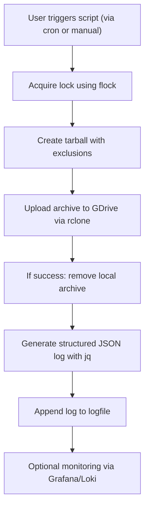

# 🗄 Backup Automation Script — Observability Meets Simplicity

> “He didn’t just want backups. &#x20;
> He wanted truth, accountability, and timestamped self-reflection.”

This documentation captures the journey of crafting a humble yet battle-hardened backup script. It’s not just a `tar` and call-it-a-day affair — this script embodies the spirit of **observability for the soul**, featuring:

* 🎒 Selective dotfile backups with exclusion logic.
* ☁️ Cloud syncing using `rclone` to Google Drive.
* 📜 JSON-formatted logging for Grafana/Loki integration.
* 🪹 Debugging with bash-powered forensic zeal.
* 🛡 Failsafe-first philosophy with locking, cleanup, and metadata collection.

This is a Linux-first, cron-friendly companion for your homelab or developer workstation.

---

## ✨ Key Features

* 💃 **Dotfile Backup by Exclusion** &#x20;
  Uses `tar` with targeted exclusion patterns and files, ensuring key configurations are preserved without clutter.

* 🌍 **Cloud Sync via Rclone** &#x20;
  Pushes archives to your GDrive using `rclone` and verifies success.

* 📊 **Grafana-Ready JSON Logging** &#x20;
  Emits structured logs using `jq`, perfect for ingestion by Loki.

* 🪲 **Built-in Concurrency Lock** &#x20;
  Uses `flock` to avoid overlapping runs and prevent conflicts.

* 🧰 **Bash Debugging Hooks** &#x20;
  Includes helpful debug statements for sanity checking.

---

## 🔬 Script Breakdown

### 1. 🔒 Locking

Prevents multiple instances from running concurrently by using `flock` and a lock file at `/tmp/dotfiles_backup.lock`.

### 2. 📚 Backup Generation

Creates a compressed archive with `tar` and `zstd`, excluding noisy directories and including key dotfiles such as `.zshrc`, `.gitconfig`, `.ssh`, and more.

### 3. ☁️ Upload to GDrive

Transfers the archive using `rclone` to `gdrive:dotfiles-backup/`. Deletes the local archive after successful upload.

### 4. 📊 Logging

Generates a structured JSON log with timestamps, host metadata, duration, file count, and size metrics using `jq`. Logs are saved to `/mnt/cortex/logs/backup-log.jsonl`.

### 5. 🛠 Error Handling

If the upload fails, logs an `error` status while still reporting duration and relevant metrics.

---

## 🧠 System Flow Diagram



---

## 📁 Folder Structure

```
dotfiles-backup-script/
├── dotfiles-backup-script.sh  # The backup script
├── backup-log.jsonl           # JSONL log output
└── README.md                  # This documentation
```

---

## 💡 Usage Instructions

1. **Ensure dependencies are installed:**

```bash
sudo pacman -S inetutils rclone jq
# or use your distribution's package manager
```

2. **Make the script executable:**

```bash
chmod +x dotfiles-backup-script.sh
```

3. **Run manually for testing:**

```bash
./dotfiles-backup-script.sh
```

4. **Set up as a cron job (daily at 2 AM, for example):**

```bash
0 2 * * * /path/to/dotfiles-backup-script.sh
```

5. **Inspect logs:**

```bash
cat /path/to/logs/backup-log.jsonl | jq '.'
```

6. **Optional: Run as a systemd service:**

```ini
# /etc/systemd/system/dotfiles-backup.service
[Unit]
Description=Dotfiles Backup Script
After=network-online.target

[Service]
ExecStart=/usr/bin/bash /path/to/dotfiles-backup-script.sh
WorkingDirectory=/path/to/
Restart=on-failure
User=youruser

[Install]
WantedBy=multi-user.target
```

Enable and start the service:

```bash
sudo systemctl daemon-reexec
sudo systemctl enable dotfiles-backup.service
sudo systemctl start dotfiles-backup.service
```

---

## 🔍 Debugging and Known Issues

* If `hostname` is empty, ensure `inetutils` is installed.
* Always verify the logfile using `jq`. If you see `null` values, double-check your `jq` arguments.
* Confirm `rclone` is properly configured by running `rclone config` before automating.

---

## ⚡ Limitations and Brutal Honesty

* Not designed for multi-user setups or remote automation without manual setup.
* No integrity checks beyond `rclone` exit codes.
* Backups are only as good as their last restore test.

  > "A backup not tested is a backup not trusted."

---

## 📜 License

This script is provided for personal and educational use. &#x20;
Fork, adapt, or modify freely — no warranties, no licenses, no strings attached.

---

Generated by Agent TL;DR v0.0.1 &#x20;
\:: Documentation unit booted under Project ARGUS &#x20;
\:: Status: markdown\_verbosity module = EXCESSIVE — Emits logs like your code depends on it &#x20;
"Summarizes everything. Writes too much."
