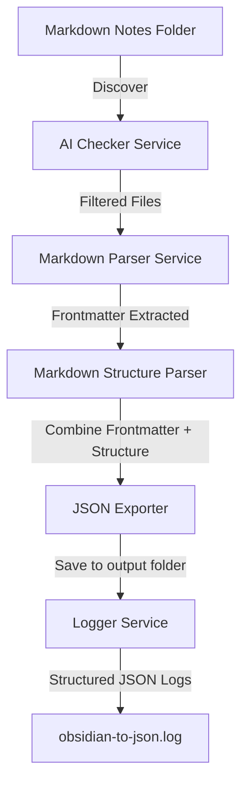

# Obsidian-to-JSON — Turn Your Markdown into Machine Food

> “He didn’t just want a note system.  
> He wanted observability for his soul.”  

`obsidian-to-json` is an **AI-driven, log-heavy, opinionated** Python utility that scans your Obsidian vault (or any Markdown folder), extracts frontmatter and structural elements, and saves them into JSON files — perfect for feeding other tools, bots, or data pipelines.
It brings sanity and reproducibility to your Obsidian note-taking workflow by enforcing structured metadata extraction, validation, and logging every step of the way.

The system is designed for those who see their note folders not just as personal spaces but as **living databases** for their digital mind systems.

---

## ✨ Features

* 🗂 **Markdown to JSON**: Converts notes into dual-layered JSON with `frontmatter` and `structure`.
* 🤖 **AI Metadata Filtering**: Scans only notes with `ai: yes` on the sacred **third line**.
* 🔥 **Robust Logging**: Every action is logged as structured JSON — observability isn't optional.
* 🧪 **Modular & Extensible**: Breaks down functions into services for easy hacking or integration.
* 💀 **CLI-native Goblin Mode**: It runs as a CLI first, with unapologetic verbosity and attitude.
* 🪄 **Safe Encoding**: Custom JSON encoder handles dirty objects that break serialization.

---

## 🧠 System Architecture



---

## 🗂 Folder Structure

```bash
obsidian-to-json/
├── __main__.py              # Main entry point, orchestrates all services
├── test_logger.py           # Testing script for the custom logger
├── .env                     # Environment config (input and output folders)
├── output/                  # Default folder for JSON outputs and logs
├── services/                # Business logic modules
│   ├── ai_checker.py        # Finds files with AI metadata
│   ├── markdown_parser.py   # Extracts YAML frontmatter
│   └── markdown_to_json.py  # Extracts structure from Markdown bodies
└── utils/
    ├── logger.py            # Custom JSON-structured logger
```

> 🔍 **Human-readable but bot-friendly**: The folder structure is purposefully layered into `services` and `utils` to reflect the separation between core tasks and reusable helpers.
> Think microservices but inside a Python package.

---

## 💡 Usage Instructions

### Environment Setup

Create your `.env` file in the root:

```ini
NOTES_FOLDER=/your/obsidian/folder
OUTPUT_FOLDER=/your/output/folder
```

### Running the app

```bash
python -m obsidian-to-json
```

#### What happens:

1. Notes in `NOTES_FOLDER` are scanned.
2. Files with `ai: yes` in line 3 are selected.
3. Frontmatter and structure extracted.
4. Combined JSON files saved in `OUTPUT_FOLDER`.
5. Every event, success, and failure is logged in `output/obsidian-to-json.log`.

### Testing the logger

```bash
python -m obsidian-to-json.test_logger
```

---

## 🚧 Limitations, Notes, and Reflections

* **Rigid assumptions**:

  * Expects `ai: yes` on line 3 — don't fight it, or hack `ai_checker.py`.
  * Frontmatter MUST be properly delimited by `---`.
* **Minimal error tolerance**: Errors are logged, not forgiven.
* **No GUI, no TUI, no frills**: It's made for CLI-first automation environments.
* **Logging is religion here**: All actions result in JSON log entries, ready for ingestion by Loki, Elasticsearch, or your digital soul.

> “You can ignore your logs, but they won't ignore you.”

---

## License

For study, research, or personal automation use. No license applies.
Use it. Abuse it. Hack it.

---

Generated by Agent TL;DR v0.0.1  
\:: Documentation unit booted under Project ARGUS  
\:: Status: markdown\_verbosity module = MANIFESTING AS GOBLIN  
"Summarizes everything. Writes too much."  
